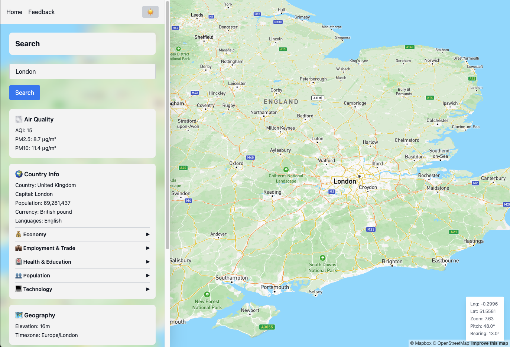

# Mapbox / Location Search Demo

[](https://github.com/sammydeveille/mapbox-sandbox/actions/workflows/ci.yml)



## Overview

- [About](#about)
- [Structure](#structure)
- [Prerequisites](#prerequisites)
- [Install](#install)
- [Run](#run)

## About

This demo is using [Mapbox](https://www.mapbox.com/), [React](), [Tailwind CSS](https://tailwindcss.com/), [Node.js](https://tailwindcss.com/), [tRPC](https://trpc.io/), [Drizzle ORM](https://orm.drizzle.team/), [PostgreSQL](https://www.postgresql.org/) and [Redis](https://redis.io/) to build a full-stack location search application with interactive map.

## Structure

### Front
- `/`: Home page with location search
- `/feedback`: Feedback list
- `/feedback/new`: Create new feedback
- `/feedback/:id/edit`: Edit existing feedback

### Back
- `feedback.list`: List all feedback
- `feedback.create`: Create new feedback
- `feedback.update`: Update existing feedback
- `feedback.delete`: Delete feedback
- `getMapboxToken`: Returns Mapbox access token
- `location.getInfo`: Fetches location data (weather, air quality, Wikipedia, country info, World Bank data)

## Prerequisites

- [Docker](https://www.docker.com)
- [Node.js](https://github.com/nvm-sh/nvm) 22
- [Mapbox](https://www.mapbox.com) Access Token

## Install

```bash
# Dependencies
npm i

# Environment file
npm run env        # Copies .env.example to .env
                   # Then set MAPBOX_ACCESS_TOKEN

# Compose containers
npm start

# Database setup
npm run db:create  # Create db
npm run db:seed    # Seed
npm run db:sync    # Drizzle schema push
```

## Run
```bash
# Compose
npm start

# Stop
npm stop

# Test
npm test
```

## Services
- Frontend: http://localhost:3000 (React + Vite)
- Backend: http://localhost:3001 (Express + tRPC)
- PostgreSQL: `localhost:5432` (Database)
- Redis: `localhost:6379` (Cache)

## Audit
```bash 
npm run audit
```
> **Note:** Known vulnerabilities in `drizzle-kit` (dev dependency). Use `--production` flag for production-only audits.


## Utils
```bash
# Database
npm run db:create  # Create db
npm run db:delete  # Delete db volume
npm run db:seed    # Seed
npm run db:sync    # Drizzle schema push
npm run db:studio

# Type checking
npm run typecheck

# Logs
npm run log
npm run log:back
npm run log:front

# Docker
npm run docker:restart
npm run docker:rebuild

# Redis
npm run redis:flush
```

## Production Readiness
- Security headers configuration
- Secrets management 
- Add comprehensive logging and monitoring
- Location API response validation and error boundaries
- DB/Cache reconnection/state management