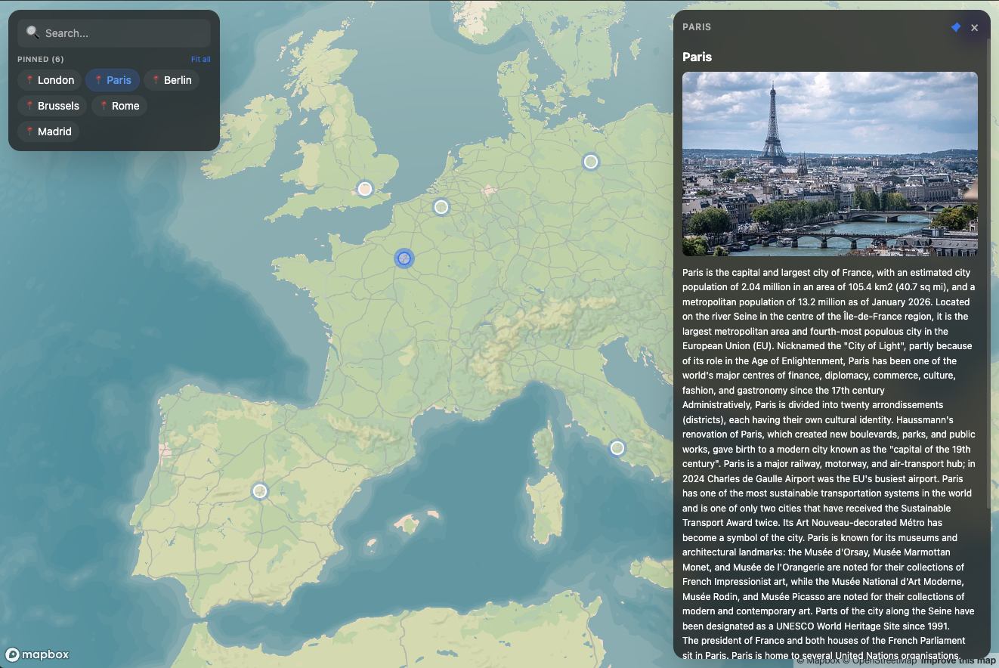

# Mapbox / Location Search Demo

[](https://github.com/sammydeveille/mapbox-sandbox/actions/workflows/ci.yml)



## Overview

- [About](#about)
- [Structure](#structure)
- [Prerequisites](#prerequisites)
- [Install](#install)
- [Run](#run)

## About

This demo is using [Mapbox](https://www.mapbox.com/), [Next.js](https://nextjs.org/) (App Router with SSR), [React](https://react.dev/), [Tailwind CSS](https://tailwindcss.com/), [Node.js](https://nodejs.org/), [tRPC](https://trpc.io/) v11, [Drizzle ORM](https://orm.drizzle.team/), [PostgreSQL](https://www.postgresql.org/) and [Redis](https://redis.io/) to build a full-stack location search application with interactive map.

The frontend uses server-side rendering to keep the Mapbox access token on the server. Geocoding requests are handled via Next.js server actions, so the token is never exposed in client-side API calls.

## Prerequisites

- [Docker](https://www.docker.com)
- [Node.js](https://github.com/nvm-sh/nvm) 22
- [Mapbox](https://www.mapbox.com) Access Token

## Install

```bash
# Dependencies
npm i

# Environment file
npm run env        # Copies .env.example to .env
                   # Then set MAPBOX_ACCESS_TOKEN

# Compose containers
npm start

# Database setup
npm run db:create  # Create db
npm run db:seed    # Seed
npm run db:migrate # Apply migrations
```

## Run
```bash
# Compose
npm start

# Stop
npm stop

# Test
npm test
```

## Services
- Frontend: http://localhost:3000 (Next.js SSR)
- Backend: http://localhost:3001 (Express + tRPC)
- PostgreSQL: `localhost:5432` (Database)
- Redis: `localhost:6379` (Cache)

## Audit
```bash 
npm run audit
```
> **Note:** Known vulnerabilities in `drizzle-kit` (dev dependency). Use `--production` flag for production-only audits.


## Utils
```bash
# Database
npm run db:studio
npm run db:create           # Create db
npm run db:generate {name}  # Generate migration with custom name
npm run db:migrate          # Apply migrations
npm run db:drop             # Remove last migration
npm run db:delete           # Delete db volume
npm run db:seed             # Seed

# Type checking
npm run typecheck

# Logs
npm run log
npm run log:back
npm run log:front

# Docker
npm run docker:restart
npm run docker:rebuild

# Redis
npm run redis:flush
```

## Production Readiness
- Security headers configuration
- Secrets management 
- Add comprehensive logging and monitoring
- Location API response validation and error boundaries
- DB/Cache reconnection/state management
